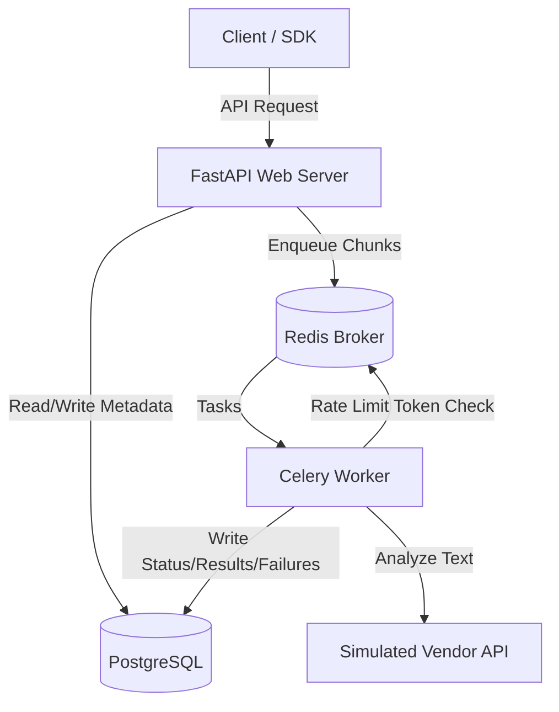

# 🚀 Async Batch Processing Service

A highly-scalable, production-ready distributed batch processing system built with **FastAPI**, **Celery**, **Redis**, and **PostgreSQL**. Designed to handle bulk item processing with built-in resiliency, rate limiting, and idempotency guarantees.

---

## 🏗 Architecture Overview

Below is the design flow of how client requests are accepted, chunked, queued, rate-limited, and processed asynchronously in the background.



---

## ✨ Key Features

- **🚀 Async Batch Processing**: Payloads are chunked (`CHUNK_SIZE = 10`) and processed concurrently in the background.
- **🛡️ Distributed Rate Limiting**: Token-bucket algorithm implemented via Lua scripts directly inside Redis to ensure per-tenant rate limits.
- **🔄 Fault Tolerance & Resiliency**: Built-in retry mechanism with exponential backoff and randomized jitter to handle transient downstream vendor errors (429, 500, timeout).
- **🔒 Idempotent Requests**: Avoid duplicate processing of identical payloads using tenant-scoped idempotency keys.
- **📊 Real-time Monitoring**: Separate endpoints to query batch progress, successful results, and detailed failure reports.

---

## 📂 Project Structure

```text
moolya_assignment/
├── app/
│   ├── api/
│   │   └── batches.py       # API Route Handlers (POST, GET status/results/failures)
│   ├── core/
│   │   ├── config.py        # Settings loader using pydantic-settings
│   │   ├── constants.py     # Configuration constants (retries, backoff, semaphore limit)
│   │   ├── database.py      # Async SQLAlchemy engine & session configuration
│   │   ├── exceptions.py    # Vendor-specific custom exceptions
│   │   └── redis.py         # Async Redis client connection
│   ├── models/
│   │   ├── batch.py         # SQLAlchemy Batch model
│   │   └── batch_item.py    # SQLAlchemy BatchItem model
│   ├── schemas/
│   │   └── batch.py         # Pydantic schemas for requests and responses
│   ├── services/
│   │   ├── batches.py       # Core service logic for batch and item management
│   │   ├── rate_limit.py    # Lua-based Redis token-bucket rate limiter
│   │   └── vendor.py        # Simulated external vendor API (random latencies & failures)
│   ├── workers/
│   │   ├── celery_app.py    # Celery application initialization
│   │   └── tasks.py         # Celery tasks running process loops with retry/backoff
│   └── main.py              # FastAPI Entry Point (lifespan database migrations)
├── docker-compose.yml       # Infrastructure orchestration (API, Worker, Postgres, Redis)
├── Dockerfile               # Shared Docker container definition
├── requirements.txt         # Python package dependencies
└── README.md                # Project documentation
```

---

## ⚙️ Configuration & Environment

The application is configured using variables defined in `.env` and core settings constants:

### **Environment Variables (`.env`)**
- `DATABASE_URL`: Connection string for PostgreSQL.
- `REDIS_URL`: Connection string for Redis cache & rate-limiter.
- `CELERY_BROKER_URL`: Celery broker connection string.
- `CELERY_RESULT_BACKEND`: Celery backend connection string.

### **Processing Constants (`app/core/constants.py`)**
- `CHUNK_SIZE` (default `10`): Number of batch items sent in a single Celery task.
- `MAX_RETRIES` (default `5`): Maximum attempts per item when hitting transient vendor failures.
- `BASE_BACKOFF` (default `2`): Base factor for exponential backoff (e.g., $2^{\text{attempt}}$ seconds).
- `MAX_BACKOFF` (default `30`): Maximum sleep interval between retries in seconds.
- `MAX_CONCURRENT_REQUESTS` (default `10`): Max concurrent calls allowed per worker chunk.

---

## 🚀 Getting Started

### **1. Prerequisites**
Ensure you have the following installed:
- [Docker](https://www.docker.com/products/docker-desktop/)
- [Docker Compose](https://docs.docker.com/compose/install/)

### **2. Start the Stack**
Run the following command to build the images and run the full stack (FastAPI, Celery worker, Redis, Postgres):
```bash
docker-compose up --build
```
This automatically:
- Starts PostgreSQL, Redis, FastAPI, and Celery.
- Initializes tables inside PostgreSQL using SQLAlchemy on startup (`lifespan` hook in `app/main.py`).

### **3. Verify Services are Running**
- FastAPI App: [http://localhost:8000/docs](http://localhost:8000/docs) (Swagger UI)
- Redis: Port `6379`
- PostgreSQL: Port `5432`

---

## 📡 API Documentation & Usage Examples

All requests require a tenant identifier and an idempotency key passed in the headers.

### **1. Create a Batch**
- **Endpoint**: `POST /batches`
- **Headers**:
  - `x-tenant-id`: Identifies the client tenant (e.g., `company_1`, `company_2`).
  - `idempotency-key`: A unique UUID for the request payload.

**Request Example**:
```bash
curl -X POST http://localhost:8000/batches \
  -H "Content-Type: application/json" \
  -H "x-tenant-id: company_1" \
  -H "idempotency-key: 123e4567-e89b-12d3-a456-426614174000" \
  -d '{
    "items": [
      "Hello world",
      "FastAPI is great",
      "Celery worker queues",
      "Fault tolerant architecture",
      "Distributed systems assignment"
    ]
  }'
```

**Response Example**:
```json
{
  "batch_id": "8fa8b7a4-15c0-430c-9694-82f5347db2aa"
}
```

---

### **2. Get Batch Status**
- **Endpoint**: `GET /batches/{batch_id}`
- **Headers**:
  - `x-tenant-id`: `company_1`

**Request Example**:
```bash
curl -X GET http://localhost:8000/batches/8fa8b7a4-15c0-430c-9694-82f5347db2aa \
  -H "x-tenant-id: company_1"
```

**Response Example**:
```json
{
  "batch_id": "8fa8b7a4-15c0-430c-9694-82f5347db2aa",
  "status": "processing",
  "total": 5,
  "done": 3,
  "failed": 0
}
```

---

### **3. Fetch Successful Results**
- **Endpoint**: `GET /batches/{batch_id}/results`
- **Headers**:
  - `x-tenant-id`: `company_1`

**Request Example**:
```bash
curl -X GET http://localhost:8000/batches/8fa8b7a4-15c0-430c-9694-82f5347db2aa/results \
  -H "x-tenant-id: company_1"
```

**Response Example**:
```json
{
  "results": [
    {
      "item_id": "fcd3a8ba-8869-42b7-a3cf-b51f8876c5f7",
      "text": "Hello world",
      "result": "Analyzed: Hello world"
    },
    {
      "item_id": "403b9bc8-cf03-4f9e-a890-0f2eb142b934",
      "text": "FastAPI is great",
      "result": "Analyzed: FastAPI is great"
    }
  ]
}
```

---

### **4. Fetch Failures**
- **Endpoint**: `GET /batches/{batch_id}/failures`
- **Headers**:
  - `x-tenant-id`: `company_1`

**Request Example**:
```bash
curl -X GET http://localhost:8000/batches/8fa8b7a4-15c0-430c-9694-82f5347db2aa/failures \
  -H "x-tenant-id: company_1"
```

**Response Example**:
```json
{
  "failures": [
    {
      "item_id": "e674b934-2e21-4fbd-8e54-4a417592cf1d",
      "text": "Fault tolerant architecture",
      "attempt_count": 5,
      "last_error": "Vendor internal error"
    }
  ]
}
```

---

## ⚡ Resiliency & Vendor Limits Simulation

The downstream service simulated in `app/services/vendor.py` exposes common network conditions:
- **10%** chance of hitting a Rate Limit (`429`) error.
- **10%** chance of hitting an Internal Server (`500`) error.
- **5%** chance of hitting a Timeout.

When rate limits or errors are hit:
1. Celery pauses and waits according to the `retry_after` parameter or exponential backoff calculation.
2. Backoff uses a randomized jitter to prevent **thundering herd** problems against the simulated vendor API.
3. If an item fails repeatedly after `MAX_RETRIES = 5`, its status is updated to `failed`, and it can be inspected via the `/failures` endpoint.
